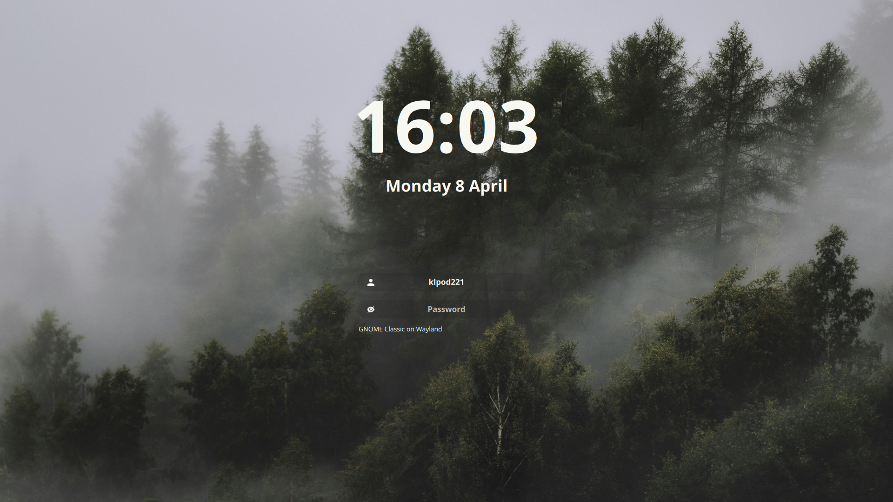
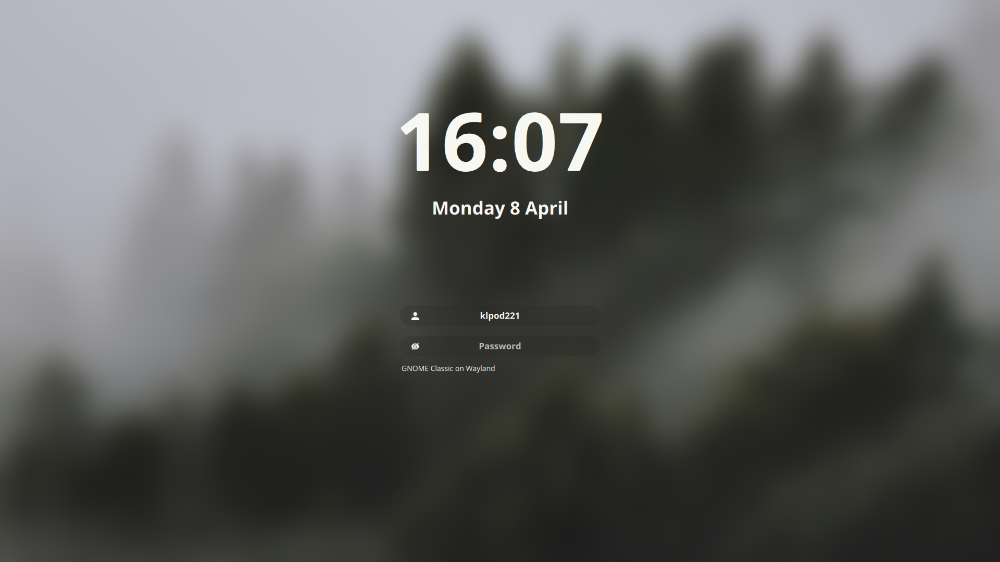

<div align="center">
  <h1>--// sddm klpod221 theme //</h1>
  
  <br>
  
  
  
</div>

# About

This is a theme for the [SDDM login manager](https://github.com/sddm/sddm).

- Screen resolution: 1080p
- Font: Open sans

# Preview






# Dependencies

Arch Linux:

```bash
sudo pacman -S qt6-5compat qt6-declarative qt6-svg sddm
```

> **Note:** If you are using a different distribution, you may need to install the equivalent packages. I don't know the names of the packages for other distributions, but you can find them by searching for the names of the packages in the package manager of your distribution.

# Install

1. Clone this repository, copy fonts to `/usr/share/fonts/`:

   ```sh
   sudo git clone https://github.com/klpod221/sddm-klpod221-theme.git /usr/share/sddm/themes/sddm-klpod221-theme
   sudo cp /usr/share/sddm/themes/sddm-klpod221-theme/Fonts/* /usr/share/fonts/
   ```

2. Then edit `/usr/lib/sddm/sddm.conf.d/default.conf`, add or change the following lines:

   ```ini
   [Theme]
   Current=sddm-klpod221-theme
   ```

# Credits

Based on the theme [`Sugar Dark for SDDM`](https://github.com/MarianArlt/sddm-sugar-dark) by **MarianArlt**.

# License

This project is licensed under the MIT License - see the [LICENSE](./LICENSE) file for details.
